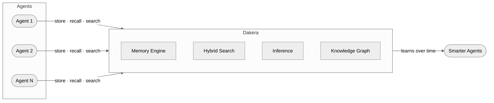
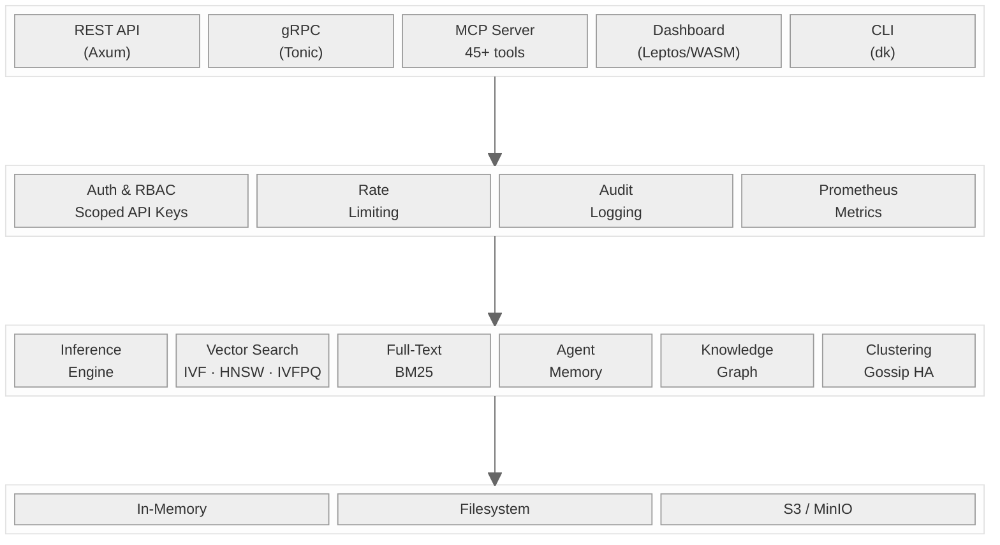
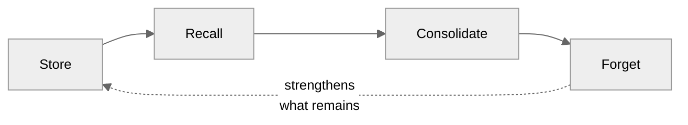
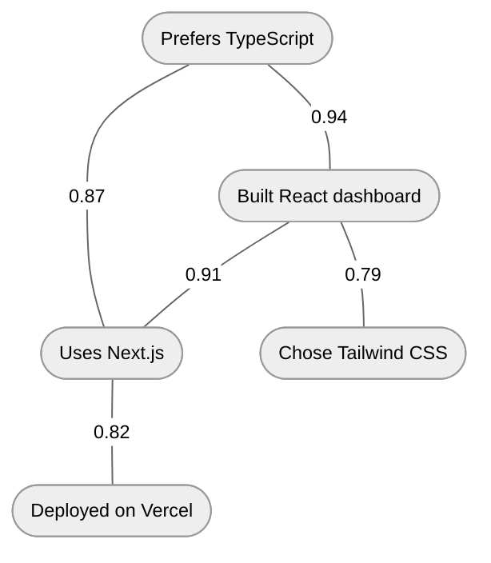

<p align="center">
  <picture>
    <source media="(prefers-color-scheme: dark)" srcset="https://img.shields.io/badge/DAKERA_AI-D4A843?style=for-the-badge&labelColor=0d0d0d&color=0d0d0d">
    
  </picture>
</p>

<h2 align="center">The Memory Engine for AI Agents</h2>

<p align="center">
  Persistent, searchable, semantic memory built in Rust.<br>
  One binary. Zero external dependencies.
</p>

<p align="center">
  <a href="https://dakera.ai"><strong>dakera.ai</strong></a> &nbsp;&middot;&nbsp;
  <a href="https://www.linkedin.com/company/dakera-ai">LinkedIn</a>
</p>

<br>

> **Your agents have amnesia.** Every session starts from zero. Every mistake repeated. Every preference forgotten. Context windows are not memory — they are expensive, fragile, and hit a hard ceiling. Dakera gives AI agents real memory — persistent, searchable, and semantic — so they learn, adapt, and improve across every session.

<br>

## Overview

Dakera is a purpose-built **memory and retrieval engine** for AI agent systems. It unifies semantic memory, hybrid search, built-in inference, knowledge graphs, and multi-agent coordination into a single Rust binary.



<br>

## Architecture

Nine Rust crates compiled into a single binary. No external services required.



<br>

## Capabilities

### Agent Memory

A cognitive memory layer — not just storage. Four memory types with lifecycle management.

| Memory Type | Purpose | Example |
|:--|:--|:--|
| **Episodic** | What happened | "User asked about pricing on March 5th" |
| **Semantic** | What it means | "User prefers TypeScript for frontend" |
| **Procedural** | How to do it | "Deploy via `dk deploy --env prod`" |
| **Working** | Active context | Current conversation state |



**Key properties:**

- **Per-agent namespaces** — Isolated memory per agent, hundreds of agents supported
- **Session lifecycle** — Context persists across conversations
- **Importance scoring** — Agents remember what matters, decay what doesn't
- **Memory consolidation** — Related memories merge and strengthen automatically

<br>

### Hybrid Search

Three search modes, one engine. Tunable weights for precision control.

| Mode | Method | Use Case |
|:--|:--|:--|
| **Vector** | Cosine · Euclidean · Dot Product | Semantic similarity |
| **Full-Text** | BM25 keyword ranking | Exact terms, names, identifiers |
| **Hybrid** | Weighted vector + BM25 | Combined precision and recall |

**Index types:** IVF, HNSW, IVFPQ
**Metadata filtering:** `$eq` · `$gt` · `$lt` · `$in` · `$and` · `$or`

<br>

### Built-in Inference

Embed text automatically on upsert and query. No external embedding service. No configuration.

```
POST /v1/namespaces/docs/upsert-text
{ "texts": [{ "id": "doc-1", "text": "Agents need persistent memory" }] }

POST /v1/namespaces/docs/query-text
{ "text": "how do agents remember things", "top_k": 5 }
```

HuggingFace models included. Auto-vectorization at ingest and query time.

<br>

### Knowledge Graph

Automatically construct knowledge graphs from stored memories.



- **Similarity edges** — Weighted connections between related memories
- **Cluster summarization** — Group and summarize knowledge regions
- **Deduplication** — Eliminate redundant memories automatically

<br>

### MCP Integration

45+ tools for MCP-compatible AI agents. Claude, Cursor, Windsurf, and others connect directly to Dakera as a persistent memory backend.

Memory operations, search, knowledge graph traversal, agent management, and session lifecycle — all exposed as callable tools.

<br>

### Production Infrastructure

| Area | Details |
|:--|:--|
| **Authentication** | Scoped API keys with RBAC — read, write, admin, super_admin |
| **APIs** | REST (Axum) and gRPC (Tonic) |
| **High Availability** | Multi-node clustering with gossip protocol, automatic rebalancing |
| **Storage** | In-memory, filesystem, or S3/MinIO backends |
| **Observability** | Prometheus metrics, health / readiness / liveness probes, audit logging |
| **Operations** | Rate limiting, backup / restore, env-based configuration |

<br>

## Request Lifecycle

```mermaid
%%{init: {'theme': 'neutral', 'themeVariables': { 'fontSize': '13px' }}}%%
sequenceDiagram
    participant Agent
    participant Dakera
    participant Storage

    rect rgb(40, 40, 40)
        Note over Agent,Storage: Store
        Agent->>Dakera: POST /v1/memory/store
        Dakera->>Dakera: Embed text
        Dakera->>Dakera: Score importance
        Dakera->>Storage: Persist
        Dakera-->>Agent: Stored
    end

    rect rgb(40, 40, 40)
        Note over Agent,Storage: Recall
        Agent->>Dakera: POST /v1/memory/recall
        Dakera->>Dakera: Embed query
        Dakera->>Storage: Semantic search
        Dakera-->>Agent: Ranked memories
    end

    rect rgb(40, 40, 40)
        Note over Agent,Storage: Connect
        Agent->>Dakera: POST /v1/knowledge/build
        Dakera->>Dakera: Discover edges
        Dakera->>Dakera: Cluster & summarize
        Dakera-->>Agent: Knowledge graph
    end
```



<br>

## SDKs & Interfaces

| Interface | Platform | Install |
|:--|:--|:--|
| Python SDK | Python 3.8+ | `pip install dakera` |
| TypeScript SDK | Node.js · Deno · Browser | `npm install dakera` |
| Go SDK | Go 1.21+ | `go get github.com/dakera-ai/dakera-go` |
| Rust SDK | Rust 1.75+ | `cargo add dakera-client` |
| REST API | Any HTTP client | Port `3000` |
| gRPC API | Any gRPC client | Port `50051` |
| MCP Server | Claude · Cursor · Windsurf | 45+ tools |
| CLI | macOS · Linux · Windows | `dk` binary |
| Dashboard | Browser | Leptos / WASM |

<br>

## Quick Start

```bash
docker run -p 3000:3000 -p 50051:50051 ghcr.io/dakera-ai/dakera:latest
```

```python
from dakera import DakeraClient

client = DakeraClient("http://localhost:3000")

# Store a memory
client.memory_store(
    agent_id="assistant-1",
    text="User prefers TypeScript for frontend work",
    memory_type="semantic",
    importance=0.9
)

# Recall by meaning
memories = client.memory_recall(
    agent_id="assistant-1",
    query="what languages does the user like?",
    top_k=5
)
# => [{ score: 0.97, text: "User prefers TypeScript for frontend work" }]
```

<br>

## The Ecosystem

Dakera is a complete platform: core engine, native SDKs for four languages, a CLI, an MCP server for AI tool integration, an admin dashboard, deployment configurations, documentation, and a multi-agent research demo.

Components are being progressively open-sourced as they reach production readiness.

**Watch this organization** to get notified as repositories go public.

<br>

## Built With

<p>
  
  
  
  
  
  
  
</p>

---

<p align="center">
  <a href="https://dakera.ai">dakera.ai</a> &nbsp;&middot;&nbsp;
  <a href="https://www.linkedin.com/company/dakera-ai">LinkedIn</a> &nbsp;&middot;&nbsp;
  <a href="https://github.com/Dakera-AI">GitHub</a>
</p>
