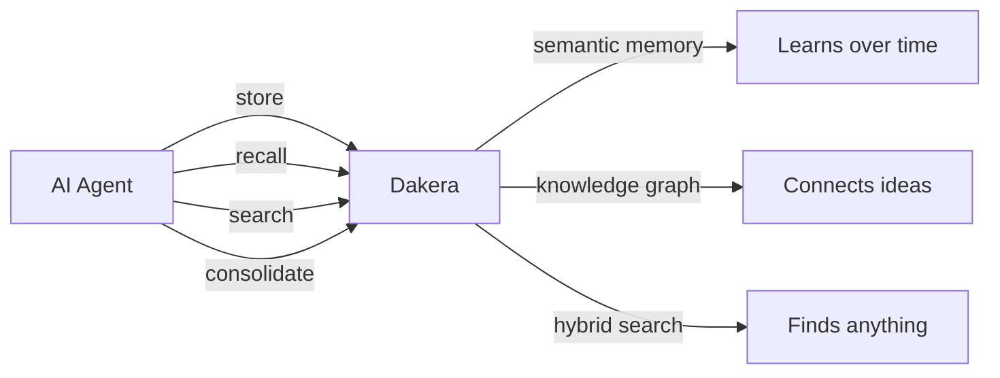
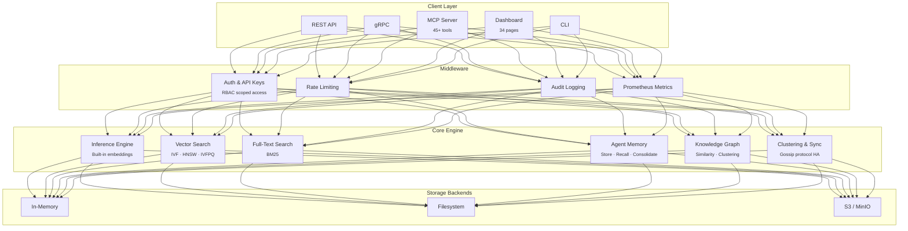
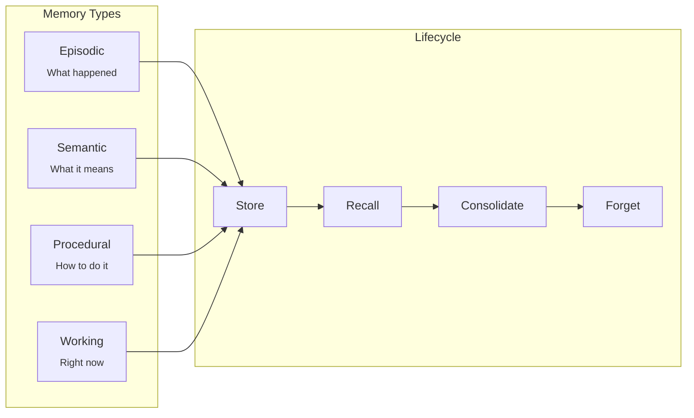
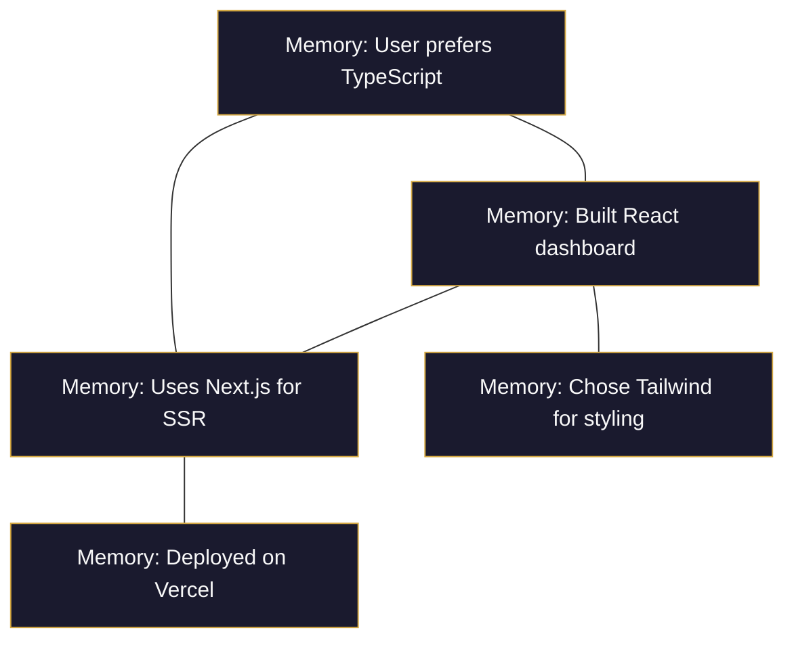
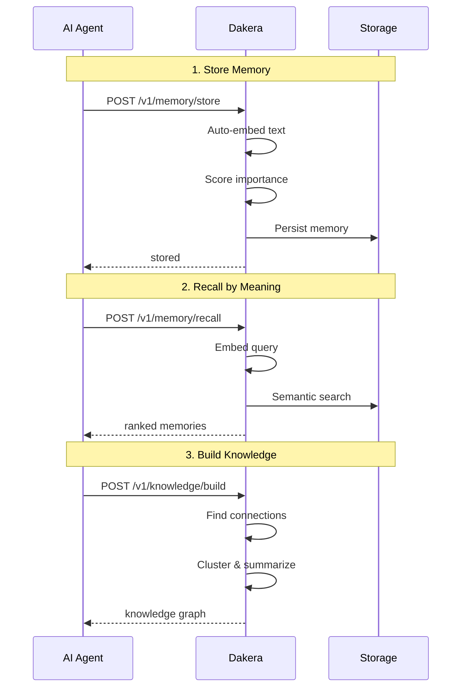

<h1 align="center">
  <br>
  Dakera AI
  <br>
</h1>

<h3 align="center">The Memory Engine for AI Agents</h3>

<p align="center">
  <em>Persistent, searchable, semantic memory built in Rust.</em><br>
  <em>Store, recall, and consolidate agent knowledge. One binary. Zero dependencies.</em>
</p>

<p align="center">
  <a href="https://dakera.ai">Website</a> &nbsp;&bull;&nbsp;
  <a href="https://www.linkedin.com/company/dakera-ai">LinkedIn</a> &nbsp;&bull;&nbsp;
  <a href="https://github.com/Dakera-AI">GitHub</a>
</p>

---

## The Problem

Every AI agent session starts from zero. Every mistake repeated. Every preference forgotten. Context windows aren't memory -- they're expensive, fragile, and hit a hard ceiling.

**Dakera gives your agents real memory** -- persistent, searchable, and semantic -- so they learn, adapt, and improve across every session.

---

## What Dakera Does

Dakera is not a generic database. It is a purpose-built **memory and retrieval engine** for AI agent systems. It unifies semantic memory, hybrid search, built-in inference, knowledge graphs, and multi-agent coordination into a single Rust binary.



---

## Architecture



---

## Core Capabilities

### Agent Memory

Real memory for AI agents -- not just storage, but a cognitive layer that makes agents smarter over time.



- **Per-agent namespaces** -- Hundreds of agents, each with isolated memory
- **Session lifecycle** -- Context survives across conversations
- **Importance scoring** -- Agents remember what matters, forget what doesn't
- **Memory consolidation** -- Automatically merge and strengthen related memories

### Hybrid Search

Three search modes in one engine with tunable weights:

| Mode | How it Works | Best For |
|:--|:--|:--|
| **Vector Similarity** | Cosine, Euclidean, Dot Product with IVF/HNSW/IVFPQ indexes | Semantic meaning, "find similar" |
| **Full-Text (BM25)** | Classic keyword ranking | Exact terms, names, codes |
| **Hybrid** | Weighted combination of vector + BM25 | Best of both worlds |

All modes support **metadata filtering** with rich operators: `$eq`, `$gt`, `$lt`, `$in`, `$and`, `$or`.

### Built-in Inference

No external embedding service needed. Dakera embeds text automatically on upsert and query:

```
POST /v1/namespaces/docs/upsert-text
{"texts": [{"id": "doc-1", "text": "Vector databases enable semantic search"}]}

POST /v1/namespaces/docs/query-text
{"text": "how do semantic search systems work", "top_k": 5}
```

HuggingFace models built in. Auto-vectorization. Semantic routing. Zero configuration.

### Knowledge Graph

Automatically construct knowledge graphs from stored memories:



- **Similarity edges** -- Automatically link related memories
- **Cluster summarization** -- Group and summarize knowledge clusters
- **Deduplication** -- Keep memory clean and non-redundant

### MCP Native

45+ tools for any MCP-compatible agent -- Claude, Cursor, Windsurf, and more. Memory, search, knowledge graphs, agent management -- all exposed as MCP tools your AI can call directly.

### Production-Grade

| Capability | Details |
|:--|:--|
| **Auth** | Scoped API keys with RBAC (read / write / admin / super_admin) |
| **APIs** | REST (Axum) + gRPC (Tonic) |
| **Clustering** | Multi-node HA with gossip protocol and automatic rebalancing |
| **Storage** | In-memory, filesystem, or S3/MinIO backends |
| **Observability** | Prometheus metrics, health/readiness/liveness probes, audit logging |
| **Operations** | Rate limiting, backup/restore, configuration via environment variables |

---

## How It Works



---

## SDKs & Interfaces

Native SDKs for the languages you already use, plus REST and gRPC for everything else:

| | Language | Install |
|:--|:--|:--|
| **Python** | Python 3.8+ | `pip install dakera` |
| **TypeScript** | Node.js / Deno / Browser | `npm install dakera` |
| **Go** | Go 1.21+ | `go get github.com/dakera-ai/dakera-go` |
| **Rust** | Rust 1.75+ | `cargo add dakera-client` |
| **REST** | Any | `curl localhost:3000/v1/...` |
| **gRPC** | Any | Port `50051` |
| **MCP** | Claude, Cursor, Windsurf | 45+ tools |
| **CLI** | Cross-platform | `dk` binary |
| **Dashboard** | Browser | Leptos / WASM, 34 pages |

---

## Quick Start

```bash
docker run -p 3000:3000 -p 50051:50051 ghcr.io/dakera-ai/dakera:latest
```

```python
from dakera import DakeraClient

client = DakeraClient("http://localhost:3000")

# Store a memory
client.memory_store(
    agent_id="assistant-1",
    text="User prefers TypeScript for frontend work",
    memory_type="semantic",
    importance=0.9
)

# Recall by meaning
memories = client.memory_recall(
    agent_id="assistant-1",
    query="what languages does the user like?",
    top_k=5
)
# => [{score: 0.97, text: "User prefers TypeScript for frontend work"}]
```

---

## The Ecosystem

Dakera is a complete platform -- not just a database. The ecosystem includes the core engine, native SDKs for four languages, a CLI, an MCP server for AI tool integration, an admin dashboard, deployment configurations, comprehensive documentation, and a multi-agent research demo showcasing real-world usage.

We're actively building in the open and will be progressively releasing components as they reach production readiness. **Star and watch this organization to stay updated.**

---

## Built With

<p>
  
  
  
  
  
  
  
</p>

---

## License

All Dakera repositories are released under the [MIT License](https://opensource.org/licenses/MIT).

---

<p align="center">
  <a href="https://dakera.ai">dakera.ai</a> &nbsp;&bull;&nbsp;
  <a href="https://www.linkedin.com/company/dakera-ai">LinkedIn</a> &nbsp;&bull;&nbsp;
  <a href="https://github.com/Dakera-AI">GitHub</a>
</p>
