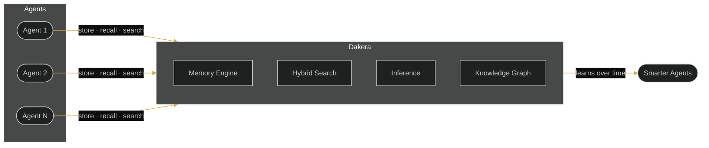
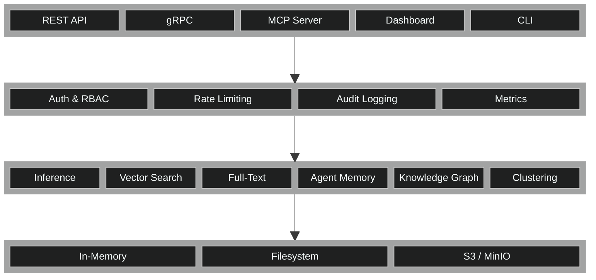
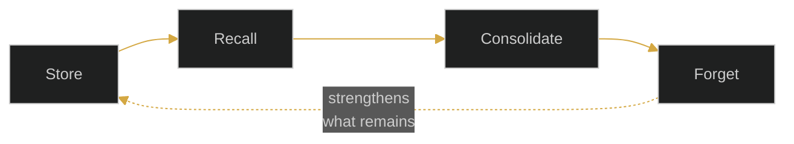
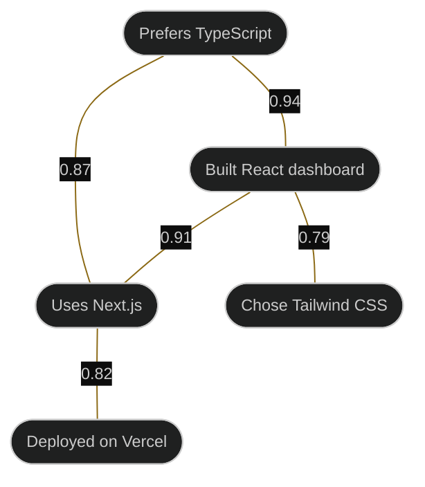
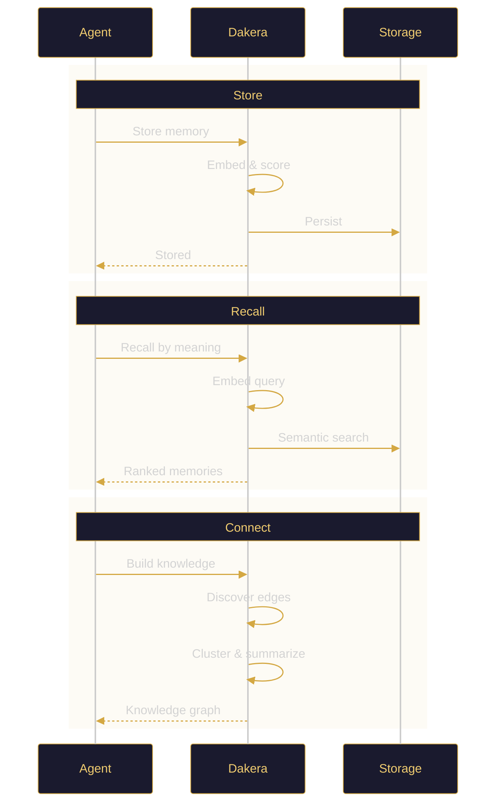

  

<h2 align="center">The Memory Engine for AI Agents</h2>

  Persistent, searchable, semantic memory built in Rust. 
  One binary. Zero external dependencies.

  <a href="https://dakera.ai"><strong>dakera.ai</strong></a> &nbsp;&middot;&nbsp;
  <a href="https://www.linkedin.com/company/dakera-ai">LinkedIn</a>

 

> **Your agents have amnesia.** Every session starts from zero. Every mistake repeated. Every preference forgotten. Context windows are not memory — they are expensive, fragile, and hit a hard ceiling. Dakera gives AI agents real memory so they learn, adapt, and improve across every session.

 

## Overview

Dakera is a purpose-built **memory and retrieval engine** for AI agent systems. It unifies semantic memory, hybrid search, built-in inference, knowledge graphs, and multi-agent coordination into a single Rust binary.

 

## Architecture

Multiple Rust crates compiled into a single binary. No external services required.

 

## Capabilities

### Agent Memory

A cognitive memory layer with four memory types and full lifecycle management.

| Memory Type | Purpose |
|:--|:--|
| **Episodic** | What happened — event-based recall |
| **Semantic** | What it means — distilled knowledge |
| **Procedural** | How to do it — learned processes |
| **Working** | Active context — current session state |

- **Per-agent namespaces** — Isolated memory per agent
- **Session lifecycle** — Context persists across conversations
- **Importance scoring** — Prioritized retention and decay
- **Memory consolidation** — Related memories merge automatically

 

### Hybrid Search

Three search modes in one engine with tunable weights.

| Mode | Method | Use Case |
|:--|:--|:--|
| **Vector** | Cosine · Euclidean · Dot Product | Semantic similarity |
| **Full-Text** | BM25 keyword ranking | Exact terms and identifiers |
| **Hybrid** | Weighted vector + BM25 | Combined precision and recall |

Supports multiple index types and rich metadata filtering.

 

### Built-in Inference

Embed text automatically on ingest and query. No external embedding service required.

 

### Knowledge Graph

Automatically discover and connect related memories.

- **Similarity edges** — Weighted connections between related memories
- **Cluster summarization** — Group and summarize knowledge regions
- **Deduplication** — Eliminate redundancy automatically

 

### MCP Integration

Exposes memory, search, knowledge graphs, and agent management as tools for MCP-compatible AI agents.

 

### Production Infrastructure

| Area | Details |
|:--|:--|
| **Authentication** | Scoped API keys with role-based access control |
| **APIs** | REST and gRPC |
| **High Availability** | Multi-node clustering with automatic rebalancing |
| **Storage** | In-memory, filesystem, or S3-compatible backends |
| **Observability** | Metrics, health probes, audit logging |
| **Operations** | Rate limiting, backup / restore, environment-based configuration |

 

## Request Lifecycle

 

## What's Coming

Dakera is under active development. The platform includes a core engine, native SDKs, a CLI, an MCP server, an admin dashboard, and deployment tooling.

**Watch this organization** to stay updated on releases.

 

## Built With

  
  
  
  

---

  <a href="https://dakera.ai">dakera.ai</a> &nbsp;&middot;&nbsp;
  <a href="https://www.linkedin.com/company/dakera-ai">LinkedIn</a>

